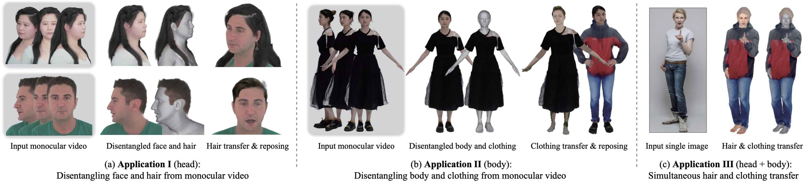
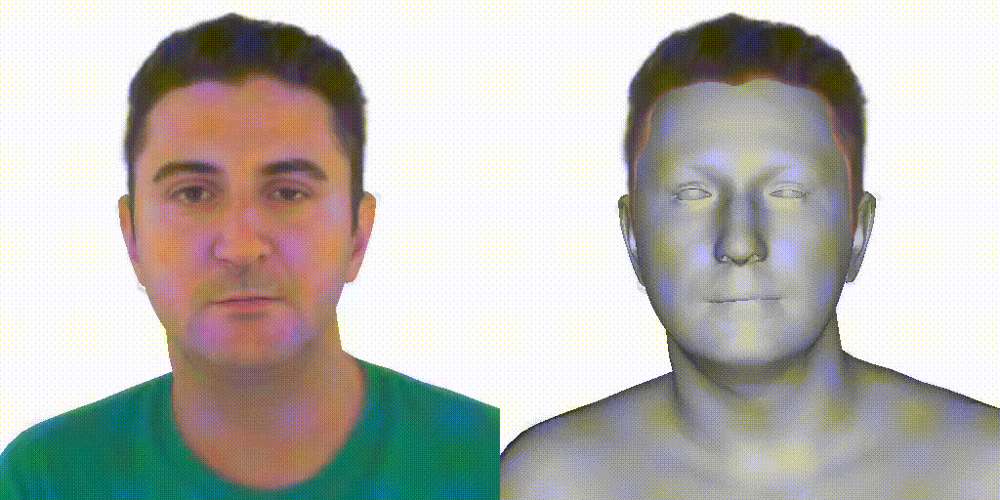
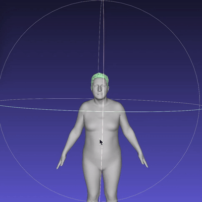
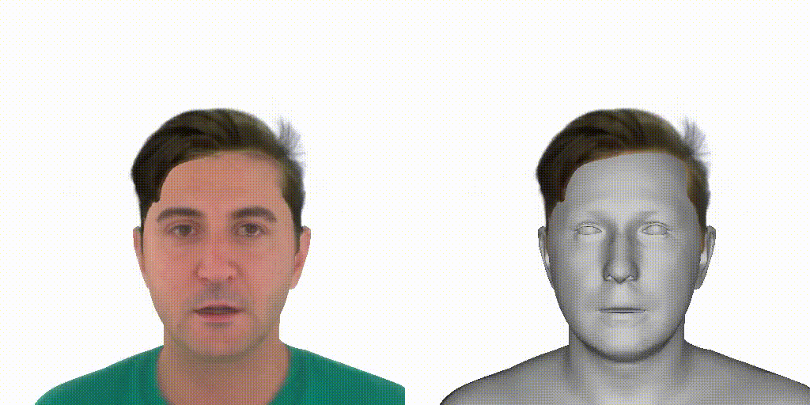
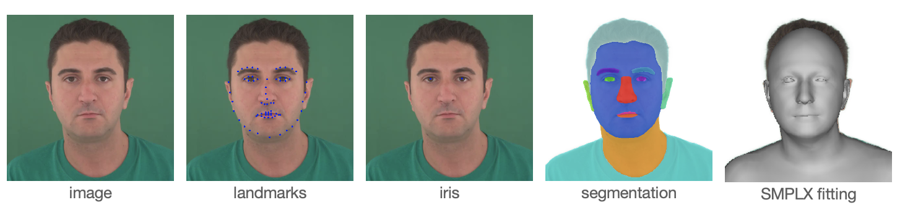
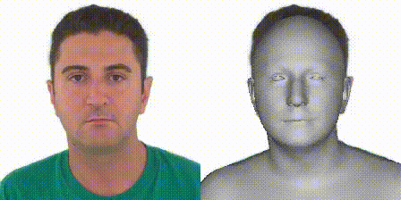
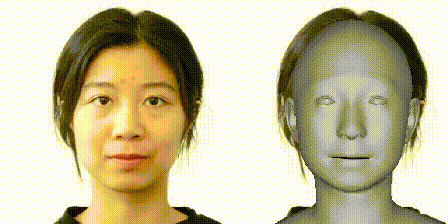

<!-- PROJECT LOGO -->

<p align="center">
  <h1 align="center">DELTA: Learning Disentangled Avatars with Hybrid 3D Representations
 </h1>
<!--  <p align="center">
    <a href="https://ps.is.tuebingen.mpg.de/person/yxiu"><strong>Yao Feng</strong></a>
    ·
    <a href="https://ps.is.tuebingen.mpg.de/person/jyang"><strong>Jinlong Yang</strong></a>
    ·
    <a href="https://ps.is.tuebingen.mpg.de/person/black"><strong>Michael J. Black</strong></a>
    .
    <a href="https://people.inf.ethz.ch/pomarc/"><strong>Marc Pollefeys</strong></a>
    .
    <a href="https://ps.is.mpg.de/person/tbolkart"><strong>Timo Bolkart</strong></a>
  </p>
  <h2 align="center">SIGGRAPH Asia 2022 conference </h2>
  -->
  <div align="center">
    
  </div>
</p> 

This is the Pytorch implementation of DELTA. More details please check our [Project](https://yfeng95.github.io/delta) page.  

DELTA leans a compositional avatar using explicit Mesh and implicit NeRF represetntaions.  
DELTA allows us to synthesize new views of the reconstructed avatar, and to animate the avatar with SMPL-X identity shape and pose control.  
The disentanglement of the body and hair/clothing further enables us to transfer hairstyle/clothing between subjects for virtual try-on applications.  
The key features:
1. animate the avatar by changing body poses (including hand articulation and facial expressions),  
2. synthesize novel views of the avatar, and  
3. transfer hair/clothing between avatars for virtual try-on applications.  

We have examples for reconstructing avatars for face/upper-body videos and full-body videos.   
For **full-body** video, please check [SCARF](https://github.com/yfeng95/SCARF).  
For generating compositional avatar from **text**, please check [TECA](https://yfeng95.github.io/teca).
  
We also provide code for data processing [here](./process_data/README.md), which includes **fitting face, neck and shoulder** to a single image or a monocular video. 

## Getting Started
Clone the repo:
  ```bash
  git clone https://github.com/yfeng95/DELTA
  cd DELTA
  ```  
### Requirements
```bash
bash install_conda.sh
``` 
If you have problems when installing [pytorch3d](https://github.com/facebookresearch/pytorch3d/blob/main/INSTALL.md), please follow their instructions.

### Download data 
```
bash fetch_data.sh
```

## Play with trained avatars
* check training frames: 
```
python main_demo.py --expdir exps --exp_name  person_0004 --visualize capture 
```
<p align="center">
  <div align="center">
    
  </div>
</p> 

* **novel view** synthesis of given frame id: 
```bash
python main_demo.py --expdir exps --exp_name  person_0004 --visualize novel_view --frame_id 0
```
<p align="center">
  <div align="center">
    
  </div>
</p> 

* extract **mesh** and visualize 
```bash
python main_demo.py --expdir exps --exp_name  person_0004 --visualize extract_mesh --frame_id 0
```
This will also save mesh objects (body only and body with hair) that you can open with Meshlab, green is for extracted hair geometry. 
<p align="center">
  <div align="center">
    
  </div>
</p> 

* **animate** with given animation sequences
```bash
python main_demo.py --expdir exps --exp_name  person_0004 --visualize animate
```
* change body shape
```bash
python main_demo.py --expdir exps --exp_name  person_0004 --visualize change_shape
```
<p align="center">
  <div align="center">
    
  </div>
</p> 

* **Hairstyle transfer**
Transfer hairstyle and visualize: 
```bash
python main_demo.py --expdir exps --exp_name person_2_train     --body_model_path exps/released_version/person_0004/model.tar  --visualize novel_view --max_yaw 20 
```
<p align="center"> 
<!--  -->

</p>

## Training 
* training DELTA
```bash
python main_train.py --expdir exps --group training_hybrid \
     --exp_cfg configs/exp/face/hybrid_ngp.yml \
     --data_cfg exps/released_version/person_0004/data_config.yaml 
```
* training NeRF only
```bash
python main_train.py --expdir exps --group training_nerf \
     --exp_cfg configs/exp/face/nerf_ngp.yml \
     --data_cfg exps/released_version/person_0004/data_config.yaml 
```
* training with your own data  

check [here](./process_data/README.md) to **prepare data with your own videos**, the processed data will be like this: 
<div align="center">
  
    <!-- <h5 align="center">cropped image, subject segmentation, clothing segmentation, SMPL-X estimation </h5> -->
</div> 
<!-- <div align="center" dis>
    <table class="images" width="100%"  style="border:0px solid white; width:100%;">
        <tr style="border: 0px;">
            <td style="border: 0px;"></a></td>
            <td style="border: 0px;"></a></td>   
        </tr>
    </table>
</div> -->

To process full body video, please check [here](https://github.com/yfeng95/SCARF/blob/main/process_data/README.md).  

Then run: 
```bash
python main_train.py --exp_cfg configs/exp/face/hybrid_ngp.yml \
     --data_cfg [data cfg file]
```


## Citation
```bibtex
@inproceedings{Feng2022scarf,
    author = {Feng, Yao and Yang, Jinlong and Pollefeys, Marc and Black, Michael J. and Bolkart, Timo},
    title = {Capturing and Animation of Body and Clothing from Monocular Video},
    year = {2022},
    booktitle = {SIGGRAPH Asia 2022 Conference Papers},
    articleno = {45},
    numpages = {9},
    location = {Daegu, Republic of Korea},
    series = {SA '22}
} 
@article{Feng2023DELTA,
    author = {Feng, Yao and Liu, Weiyang and Bolkart, Timo and Yang, Jinlong and Pollefeys, Marc and Black, Michael J.},
    title = {Learning Disentangled Avatars with Hybrid 3D Representations},
    journal={arXiv},
    year = {2023}
} 
```
## Acknowledgments 
Here are some great resources we benefit from:
- [face alignment](https://github.com/1adrianb/face-alignment) to detect face keypoints
- [MediaPipe](hhttps://github.com/patlevin/face-detection-tflite) to detect iris
- [MODNet](https://github.com/ZHKKKe/MODNet) to segment subject
- [face-parsing](https://github.com/zllrunning/face-parsing.PyTorch) to segment hair
- [RobustVideoMatting](https://github.com/PeterL1n/RobustVideoMatting) for background segmentation
- [cloth-segmentation](https://github.com/levindabhi/cloth-segmentation) for clothing segmentation
- [PIXIE](https://github.com/yfeng95/PIXIE) for SMPL-X parameters estimation  
- [smplx](https://github.com/vchoutas/smplx) for body models 
- [PyTorch3D](https://github.com/facebookresearch/pytorch3d) for Differential Rendering
- [NerfAcc](https://github.com/KAIR-BAIR/nerfacc) 
- [DECA](https://github.com/yfeng95/DECA) 
- [Neural Head Avatars](https://github.com/philgras/neural-head-avatars)  
Some functions are based on other repositories, we acknowledge the origin individually in each file.

## License

This code and model are available for non-commercial scientific research purposes as defined in the [LICENSE](LICENSE) file. By downloading and using the code and model you agree to the terms in the [LICENSE](LICENSE).
